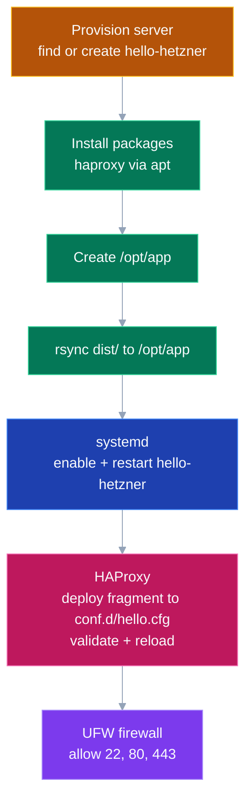

# hello-hetzner

Minimal "Hello, World!" deployment to [Hetzner Cloud](https://www.hetzner.com/cloud/) via GitHub Actions. One Python script, one HAProxy config fragment, one workflow file -- zero runtime dependencies beyond what ships with Ubuntu 24.04.

> **Philosophy:** The entire stack runs on packages already present in the base Ubuntu 24.04 image -- system Python 3, HAProxy via apt, systemd, and UFW. No pip installs, no container runtimes, no external libraries.

---

## Architecture


A push to `main` triggers a single GitHub Actions job that delegates to [`juliankahlert/hetzner-deploy-action@main`](https://github.com/juliankahlert/hetzner-deploy-action). The action provisions a CX23 server, syncs application files, configures systemd and HAProxy, and hardens the firewall -- all idempotently.

HAProxy listens on port **80**, matches `path_beg /hello`, and proxies to `127.0.0.1:4001` where `server.py` responds. UFW enforces deny-by-default and allows only ports 22, 80, and 443.

**Key design decisions:**

- **Zero dependencies** -- only system Python 3, HAProxy via apt, systemd, and UFW; nothing to install at runtime.
- **Idempotent deploys** -- every workflow run converges to the same state regardless of prior server condition.
- **Fragment-based HAProxy** -- the project ships a single cfg fragment; the deploy action merges it into the system HAProxy config.
- **Firewall by default** -- UFW deny-all policy with explicit allows for SSH (22), HTTP (80), and HTTPS (443).

---

## Repository Structure

| Path | Purpose |
|------|---------|
| `dist/server.py` | Python HTTP server -- serves `GET /hello` on port 4001 |
| `server.py` | System dashboard server -- serves static UI + `/api/stats` JSON on port 8000 |
| `static/index.html` | Dashboard frontend -- cards for CPU, memory, disk, network |
| `static/style.css` | Dashboard stylesheet -- dark industrial theme |
| `static/app.js` | Dashboard logic -- polls `/api/stats` every 1 s, sparklines |
| `infra/haproxy-hello.cfg` | HAProxy fragment -- routes `:80/hello` to `:4001` |
| `.github/workflows/deploy.yml` | GitHub Actions workflow -- triggers on push to `main` |
| `LICENSE` | MIT |

---

## System Dashboard

A zero-dependency live system monitor. One Python file reads `/proc` (Linux) and `shutil.disk_usage`, a background thread computes rates, and a vanilla HTML/CSS/JS frontend polls the JSON API every second.

```bash
python3 server.py            # default port 8000
python3 server.py --port 9000  # custom port
```

Open [http://localhost:8000](http://localhost:8000) in a browser. The dashboard shows:

| Metric | Source | Update |
|--------|--------|--------|
| CPU % | `/proc/stat` delta | ~1 s |
| CPU count | `os.cpu_count()` | static |
| Load average | `os.getloadavg()` | ~1 s |
| Memory total / available | `/proc/meminfo` | ~1 s |
| Disk total / used | `shutil.disk_usage("/")` | ~1 s |
| Uptime | `/proc/uptime` | ~1 s |
| Network RX/TX rate | `/proc/net/dev` delta | ~1 s |

> **Note:** On non-Linux systems (macOS, Windows) metrics that rely on `/proc` return `null` and the frontend shows `--`. Load average and disk usage still work on macOS.

---

## Deployment

### 1. Configure Secrets

Add three repository secrets under **Settings > Secrets and variables > Actions**:

| Secret | Description | How to generate |
|--------|-------------|-----------------|
| `HCLOUD_TOKEN` | Hetzner Cloud API token | Hetzner Cloud Console > API Tokens > Generate |
| `SSH_PRIVATE_KEY` | Deploy SSH private key | `ssh-keygen -t ed25519 -C "deploy"` -- paste private key |
| `SSH_PUBLIC_KEY` | Matching public key | Contents of the `.pub` file |

> **Warning:** Never commit private keys or API tokens to the repository.

### 2. Push to `main`

The workflow triggers automatically on every push to `main`. It runs a single job:

```yaml
- name: Deploy to Hetzner
  uses: juliankahlert/hetzner-deploy-action@main
  with:
    hcloud_token:          ${{ secrets.HCLOUD_TOKEN }}
    ssh_private_key:       ${{ secrets.SSH_PRIVATE_KEY }}
    public_key:            ${{ secrets.SSH_PUBLIC_KEY }}
    server_name:           hello-hetzner
    project_tag:           hello-hetzner
    source_dir:            ./dist
    target_dir:            /opt/app
    service_name:          hello-hetzner
    firewall_enabled:      'true'
    haproxy_fragment:      ./infra/haproxy-hello.cfg
    haproxy_fragment_name: hello
```

### 3. What the Action Does



Every stage is idempotent -- re-running the workflow converges to the same state. The action outputs `server_ip`, `server_id`, and `server_status` for use in subsequent steps.

---

## Verification

### Local

Run the server locally and confirm the `/hello` endpoint:

```bash
python3 dist/server.py &
curl -i http://localhost:4001/hello
# HTTP/1.0 200 OK
# Hello, World!

curl -i http://localhost:4001/other
# HTTP/1.0 404 Not Found
# Not Found

kill %1
```

### Post-Deploy

After the workflow completes, read the server IP from the **Log deploy outputs** step and verify:

```bash
# Replace <server_ip> with the value from the workflow output
curl -i http://<server_ip>/hello
# HTTP/1.1 200 OK
# Hello, World!
```

The request path: client hits HAProxy on port 80 → ACL matches `path_beg /hello` → traffic proxies to `127.0.0.1:4001` → `server.py` responds.

---

## License

[MIT](LICENSE)
